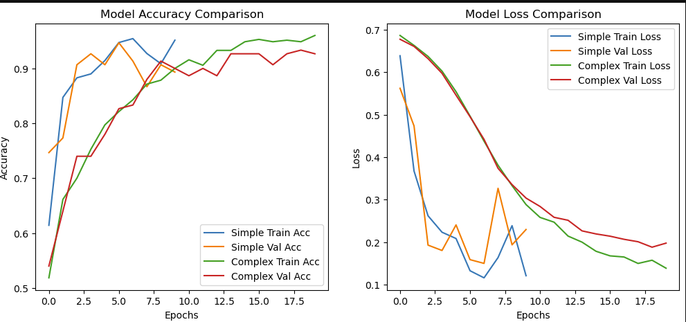
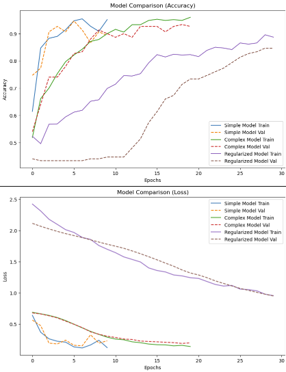

# AI Art Detection using Machine Learning

This project aims to classify whether an artwork is AI-generated or human-created using machine learning techniques.

## Project Overview

With the rise of generative AI tools, distinguishing between AI-generated and human-created art has become increasingly important. This project explores how machine learning models can be used to detect patterns and differences between these two types of artwork.

## Objectives

- Build a classification model to detect AI-generated art
- Compare performance of different machine learning models
- Analyze overfitting and model generalization
- Evaluate model performance using accuracy and loss metrics

## Dataset

- AI-generated images
- Real artwork images

Images were preprocessed and converted into numerical features suitable for machine learning models.

## Tools and Technologies

- Python
- NumPy
- Pandas
- TensorFlow / Keras
- Matplotlib

## Workflow

1. Data collection and preprocessing  
2. Image resizing and normalization  
3. Feature extraction  
4. Model building (Simple, Complex, Regularized)  
5. Training and evaluation  
6. Performance comparison using accuracy and loss  

---

## Model Performance

### Accuracy Comparison

### Loss Comparison

---

## Model Insights

- The Simple Model learns quickly but shows unstable validation performance.
- The Complex Model provides more stable and consistent accuracy improvements.
- The Regularized Model helps reduce overfitting and improves generalization.
- Validation loss decreases steadily, indicating effective learning.
- Overall, the Complex and Regularized models perform better than the Simple model.

---

## Why This Project Matters

AI-generated content is becoming widespread, making it important to develop systems that can detect synthetic media. This project demonstrates how machine learning can be applied to solve real-world problems in digital authenticity and content verification.

---

## Future Improvements

- Use Convolutional Neural Networks (CNNs) for better image feature extraction
- Increase dataset size for improved accuracy
- Apply data augmentation techniques
- Deploy the model using a web interface (Streamlit or FastAPI)
- Experiment with transfer learning (e.g., VGG, ResNet)

---

